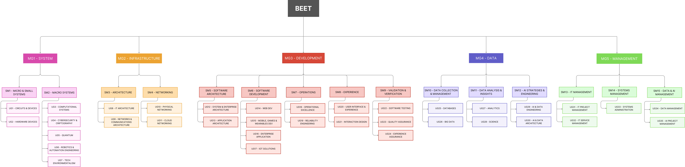
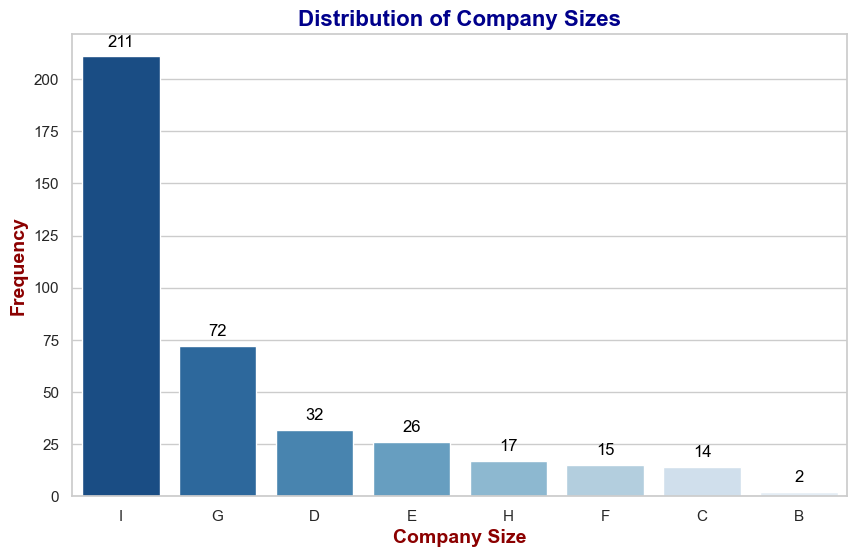
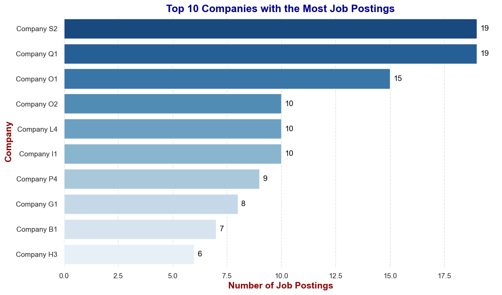
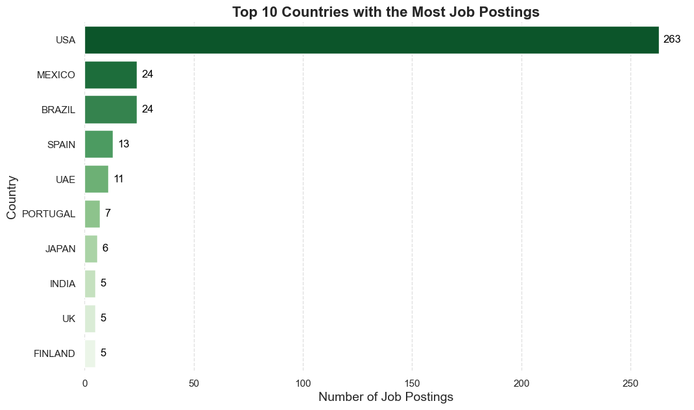
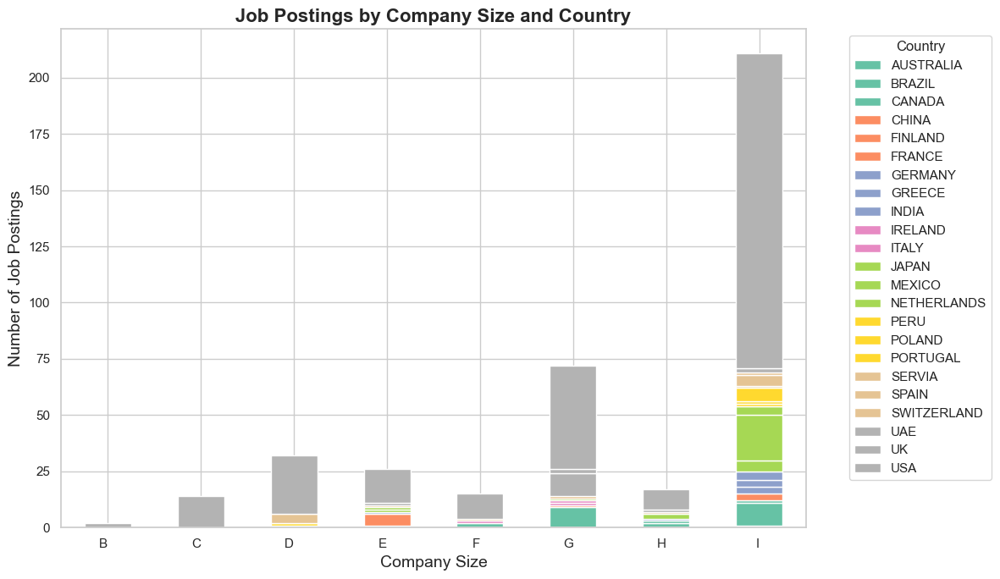
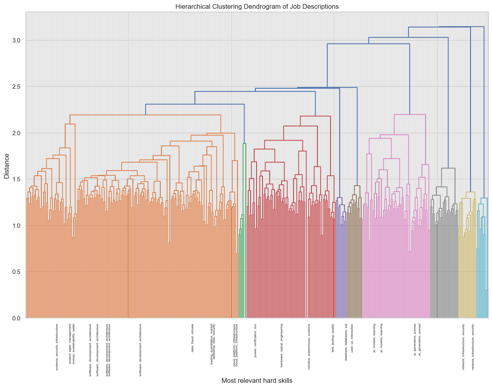

# BEET: A Comprehensive Taxonomy for IT Job Classification

BEET (Bee-inspired Employment and Expertise Taxonomy) is a hierarchical framework designed to classify IT jobs within the ISCO-08 structure. It provides a structured and precise classification system that helps categorize IT roles, forecast workforce demands, and guide educators in preparing professionals for Industry 5.0.

## Why BEET?

A decade of digitalization has pushed **Technology-driven roles to the center of the global job market**, yet employers and educators still lack a common, **skills-first** language to describe what different IT jobs actually require. That inconsistency makes it harder to (i) classify jobs accurately, (ii) align training, and (iii) forecast demand. Existing standards such as **ISCO-08** are invaluable but not sufficiently granular for today’s hybrid roles and fast-moving stacks. This paper presents **BEET**: a hierarchical framework built from **real job postings** collected worldwide between **2023 and 2025**.  
> Source: World Economic Forum; Frontiers in Education (2025)

**BEET** addresses this gap by introducing:

- A hierarchical structure with 5 major groups, 15 sub-major groups, and 35 unit groups as shown in Figure 1.

- A focus on hard skills and seniority levels.

- A data-driven approach based on global IT job postings (2023-2025).




*Figure 1: Hierarchical structure of BEET Taxonomy.*

## Where does data comes from and what it looks like?

The team gathered **public, English-language job postings** directly from company sites and verified sources, spanning **October 2023 to February 2025**. Collection mixed **web crawlers** and **targeted manual searches** to balance categories and avoid over-representing only the most advertised roles. Postings were filtered to ensure **explicit technical requisites** relevant to Industry 5.0 skills.  

To build, validate, and illustrate BEET, the **labeled dataset** comprises **389 IT postings** from **221 unique companies** of varied sizes and regions. Company names were anonymized and mapped to **LinkedIn size codes (A–I)**. The distribution is dominated by the largest organizations: sizes **I** and **G** contribute most postings; **B** has only two, and **A** has none.

  

*Figure 3 — Frequency of job postings published by companies according to their size.*

As previously mentioned, the goal was to maintain a balanced distribution of job categories within the dataset, as well as a proportional representation of companies publishing job postings. Only six companies have between 10 and 19 job postings, while most contribute **six or fewer**.

 

*Figure 4 — Top 10 companies with the most job postings.*

Geographically, the **United States** publishes the highest count (**263**), followed by **Brazil** and **Mexico** (**24** each), **Spain** (**13**), and the **UAE** (**11**). These patterns reflect both market size and recruiting practices in innovation hubs.

 

*Figure 5 — Top 10 countries with the highest number of job postings.*

Crossing **country × size** shows that postings from **large firms (I, G)** concentrate in leading tech geographies (e.g., USA, UK, UAE). When roles cluster in specific regions and company sizes, **language clusters too**, shaping which skills appear salient.

  

*Figure 6 — Distribution of job postings by company size and country of publication.*


## How BEET was constructed?

From the cleaned corpus of postings, the authors applied natural language processing (NLP) techniques to create representations of job vacancies, focusing on skills, technology knowledge, and technical requirements requested. Subsequently, they employed an agglomerative hierarchical clustering algorithm: **Average Linkage Hierarchical Clustering (ALHC)** with **Ward’s criterion**. The process initially yielded **32 clusters**, which were then grouped into **nine** broader thematic groups and, through expert synthesis, consolidated as the backbone of the taxonomy. Cluster validity scores (e.g., **Silhouette ≈ 0.047**) align with the nature of job postings, where distinctions between roles are often nuanced rather than sharply defined. More importantly, the clustering serves as a strong foundation for human experts to refine the classification, helping to uncover meaningful groupings and better distinguish job categories based on domain knowledge.

  
*Figure 1 — Hierarchical clustering dendrogram obtained from job vacancy descriptions.*

Following meticulous data labeling and clustering, the development of the Bee-inspired Employment and Expertise Taxonomy (BEET) was a collaborative effort between the HR team and the authors of this article.  **BEET** was constructed as a **three-level hierarchy** as shown in Figure 1: **5 Major Groups (MG)**, **15 Sub-Major (SM)**, and **35 Unit Groups (UG)**, each aligned with **ISCO-08**.

## BEET Structure

| MG                       | SM (ID & Name)                        | Unit Groups (UG#: Name)                                                                                                                        |
| ------------------------ | ------------------------------------- | ---------------------------------------------------------------------------------------------------------------------------------------------- |
| **MG1 — System**         | **SM1 Micro & Small Systems**         | UG1 Circuits and Devices; UG2 Hardware Integration                                                                                             |
|                          | **SM2 Macro Systems**                 | UG3 Computational Systems; UG4 Cybersecurity and Criptography; UG5 Quantum; UG6 Robotics and Automation Engineering; UG7 Tech Environmentalism |
| **MG2 — Infrastructure** | **SM3 Architecture**                  | UG8 IT Architecture; UG9 Networks & Communications Architecture                                                                                |
|                          | **SM4 Networking**                    | UG10 Physical Networking; UG11 Cloud Networking                                                                                                |
| **MG3 — Development**    | **SM5 Software Architecture**         | UG12 System & Enterprise Architecture; UG13 Application Architecture                                                                           |
|                          | **SM6 Software Development**          | UG14 Web Dev; UG15 Mobile/Games/Wearables Dev; UG16 Enterprise Application; UG17 IoT Solutions                                                 |
|                          | **SM7 Operations**                    | UG18 Operational Excellence; UG19 Reliability Engineering                                                                                      |
|                          | **SM8 eXperience**                    | UG20 UI/UX; UG21 Interaction Design                                                                                                            |
|                          | **SM9 Validation & Verification**     | UG22 Software Testing; UG23 Quality Assurance; UG24 Experience Assurance                                                                       |
| **MG4 — Data**           | **SM10 Data Collection & Management** | UG25 Databases; UG26 Big Data                                                                                                                  |
|                          | **SM11 Data Analysis & Insights**     | UG27 Analytics; UG28 Science                                                                                                                   |
|                          | **SM12 AI Strategies & Engineering**  | UG29 AI & Data Engineering; UG30 AI & Data Architecture                                                                                        |
| **MG5 — Management**     | **SM13 IT Management**                | UG31 IT Project Management; UG32 IT Service Management                                                                                         |
|                          | **SM14 Systems Management**           | UG33 Systems Administration                                                                                                                    |
|                          | **SM15 Data & AI Management**         | UG34 Data Management; UG35 AI Project Management                                                                                               |


### Applications

BEET is designed to support various stakeholders in the IT job market, including:

- HR Professionals: Align applicants with job opportunities more effectively.

- Workforce Analysts: Forecast labor market trends and IT job demands.

- Educators: Structure training programs aligned with Industry 5.0 needs. 

---

## Conclusion

The introduction of BEET marks a significant advancement as a framework to support the task of IT jobs classification, since it represents a detailed tool adapted to the evolving demands of the technology sector in the context of Industry 5.0.

### What BEET reveals about the market

The descriptive analysis of the BEET dataset reveals significant insights into the landscape of IT job postings across various company sizes and geographical regions. The predominance of larger organizations in the dataset highlights the concentration of opportunities within established companies, particularly in technology and innovation hubs. Furthermore, the variations in job categories and postings underscore the technical specificity of roles within the industry. By leveraging the BEET framework, we can better understand the dynamics of the IT labor market, paving the way for more targeted research and analysis.

  
*Figure 7 — Word clouds for the five Major Groups.*

---

## Scope and limitations

The present dataset is **English-only** and drawn from **public** postings, which may under-represent internal pipelines or markets where English is not dominant. Company size and region are **uneven by market**, not by design, and should be considered when generalizing results. Next steps include **multilingual expansion** and **automated classifiers** (including GenAI models) that ingest BEET and label postings at scale.  
> Source: Frontiers in Education (2025)

---

## How to reproduce the figures and clustering (`BEET-EDA.ipynb`)

You can regenerate the descriptive figures and clustering visuals using the notebook in this repository.

**Environment**  
Use **Python 3.10+** in a fresh virtual environment (or Google Colab).

**Dependencies**  
Install the libraries referenced in the **first cell** of `BEET-EDA.ipynb` (for local runs, common requirements include `pandas`, `numpy`, `scikit-learn`, `matplotlib`, `seaborn`, and `wordcloud`). If a `requirements.txt` is added later, prefer it.

**Data placement**  
Place the input files in the repo’s `data/` directory as expected by the notebook.

**Run**  
Open `BEET-EDA.ipynb` and select **Run All**. The notebook writes images to `figs/`. 

---

## Data & code availability

All materials for this article are available in `jvalverr/beet-it-jobs-taxonomy` (folders: `data/`, `clusters/`, `figs/`, and `BEET-EDA.ipynb`). Please check the repository for updates as the taxonomy evolves.  

---


## Citation

When referencing this project, please use the following citation formats:


Jorge Valverde-Rebaza, Fabiana Góes, Julieta Noguez, and Nathalia C. Da Silva. Skill-based Employment Taxonomy in the global IT Industry 5.0. Frontiers in Education, April 2025.

```bibtex
@article{valverde:frontiers:25,
  title={{Skill-based Employment Taxonomy in the global IT Industry 5.0}},
  author={Valverde-Rebaza, J. and Góes, F. and Noguez, J. and Da Silva, N.},
  journal={Frontiers in Education},
  volume = {10},
  DOI={10.3389/feduc.2025.1418184},
  ISSN={2504-284X},
  year={2025},
}
```


